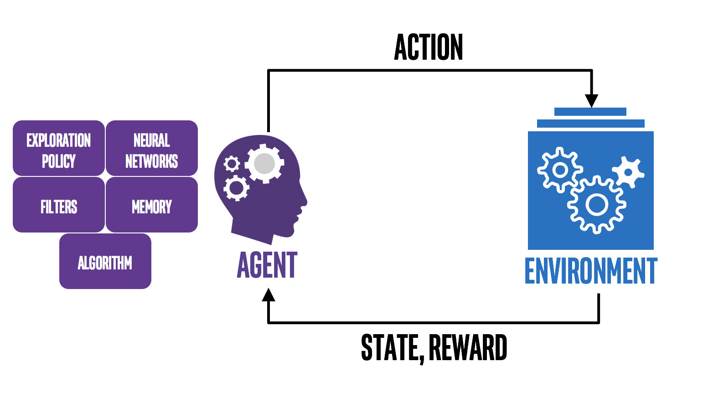

```{r setup, include=FALSE}
knitr::opts_chunk$set(echo = TRUE)
```

Consider the following scenario: a mother is trying to encourage her child to do the dishes at the end of every day. No matter how many times she expresses this to her child, they do not do the dishes. In this case, she wants to reinforce a particular behavior (washing the dishes). A great way to do this is to offer some sort of reward, like an allowance. If she were to give her child an allowance upon the successful washing of the dishes, she would find that this encourages her child to do their chores. This is an example prominent in psychology called positive reinforcement. In essence, positive reinforcement refers to the addition of something (in this example, an allowance) to reinforce a behavior (doing chores). This psychological phenomena is the logic that underpins reinforcement learning.

#### What is Reinforcement Learning?

Reinforcement learning is a machine learning method that sits outside both supervised learning (which learns from a training set of labeled examples) and unsupervised learning (which identifies hidden structures from unlabeled data). Instead, reinforcement learning involves training an agent to learn how to make decisions to get the desired result through trial-and-error. The agent interacts with the environment, receives feedback in the form of rewards or penalties, and adjusts its actions to maximize the total reward over time.

{width="527"}

#### Reinforcement Learning: The Main Elements

There are *four* main elements in reinforcement learning:

1.  Policy: an agent's way of behaving at any given time

2.  Reward Signal: immediate reward following an action

3.  Value Function: the total amount of reward an agent can expect to accumulate in the future, starting from the current state

4.  Model of Environment: allows for inferences of how the environment will behave, used for planning

{width="527"}

#### Exploitation vs. Exploration

Reinforcement models need to balance exploitation (using actions that it already knows will result in a reward) and exploration (trying new actions that could potentially result in a reward). A model with maximized exploitation will quickly find a solution, but will likely be suboptimal since it continues with the first actions that resulted in a reward. On the other hand, a model with maximized exploration will continuously discover new possible actions but never find a solution since it discounts which actions produce the reward.

#### Discount Factor

In reinforcement learning, there are two types of rewards to consider: immediate rewards vs. future rewards. The discount factor, a value between 0 and 1, determines the importance of future rewards to the agent as it learns. When set to 0, the agent will be short-sighted and only consider current rewards. This could result in a good outcome, but not the *best* outcome. When set to 1, the agent will try to look for a greater reward over a longer course of play, thus resulting in a better outcome.

#### GridWorld

To demonstrate how the exploration-exploitation trade-off and the discount factor can impact reinforcement learning, we chose to use the example of GridWorld. In our GridWorld environment, there are eleven possible states, as illustrated below. The agent will start at the bottom left corner, S1. The goal is to reach one of the two end states: S5 or S11. In order to do this, the agent will move throughout the grid. However, each action results in a negative reward: -1. However, if the agent manages to reach one of the two end states, they receive a positive reward. There is a catch: for state S5, the reward awarded to the agent is only 5, whereas if the agent manages to reach S11, it will receive a reward of 10. This will allow us to demonstrate differences between a short-sighted agent and a far-sighted agent.


#### Benefits & Limitations

#### Resources
